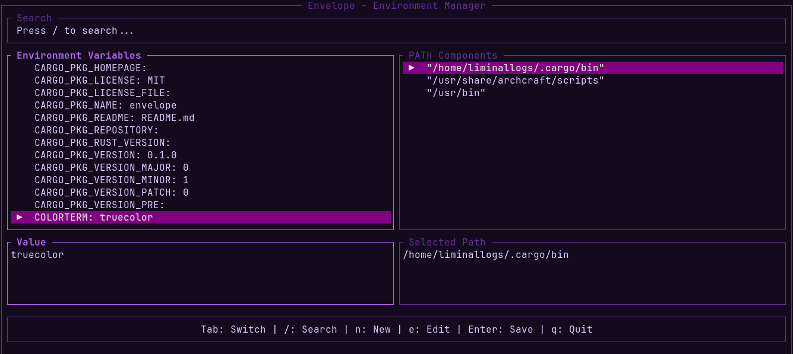

# Envelope



Envelope is a focused terminal UI for understanding and maintaining the environment that your shell exposes. It puts environment variables and PATH entries side by side, with search, editing, and shell-config persistence in one workflow.

## Install

Install from crates.io:

```sh
cargo install envelope
```

Or download a Linux or macOS binary from [GitHub Releases](https://github.com/LorenzoEvans/envelope/releases).

Run it from a shell:

```sh
envelope
```

Envelope is Unix-first and supports bash, zsh, and fish configuration files. It detects the active shell and writes to the matching user configuration file when one is available.

## Controls

| Key | Action |
| --- | --- |
| `Tab` | Switch between variables and PATH |
| `/` | Search names, values, and PATH entries |
| `n` | Create a variable |
| `e` | Edit the selected value or PATH entry |
| `Enter` | Advance a form or save an edit |
| `Esc` | Cancel the active interaction |
| `q` / `Ctrl-C` | Quit |

## Persistence

Edits are applied to the current session view and persisted to the detected shell config only after saving. Envelope preserves unrelated lines, replaces matching variable assignments, quotes values for shell use, and writes through a temporary file before replacing the config.

PATH edits update the selected entry and append a future-shell PATH assignment. Complex existing PATH expressions are preserved rather than rewritten. Always review the displayed config file before relying on a change in a new shell session.

## Roadmap

- Fuzzy search and richer filtering
- Delete variables and PATH entries
- Import and export environment snapshots
- Persistent system-wide configuration support

## Development

```sh
cargo fmt --all -- --check
cargo clippy --workspace --all-targets --all-features -- -D warnings
cargo test --workspace --all-features
cargo doc --workspace --all-features --no-deps
cargo package --list --locked
```

Envelope is built with Rust, Ratatui, and Crossterm. Contributions should preserve the small, testable application core and keep shell configuration writes conservative.
